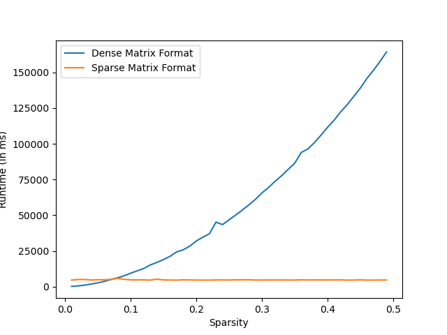

# Assignment 1: Matrix Multiplication

This directory contains programs for matrix multiplications - in sparse form and in dense form. The matrix representations has been made has 2D array for sparse matrices and Maps of Maps form for Dense matrices. The multiplication programs have been benchmarked and the plots have been provided. Assignment question has been mentioned in the [document](assignment_1.pdf).

## Introduction

In numerical analysis and scientific computing, a sparse matrix or sparse array is a matrix in which most of the elements are zero. There is no strict definition regarding the proportion of zero-value elements for a matrix to qualify as sparse but a common criterion is that the number of non-zero elements is roughly equal to the number of rows or columns. By contrast, if most of the elements are non-zero, the matrix is considered dense. The number of zero-valued elements divided by the total number of elements (e.g., m × n for an m × n matrix) is sometimes referred to as the sparsity of the matrix.

(source: [Wikipedia](https://en.wikipedia.org/wiki/Sparse_matrix), retrieved: 14-12-2021)

## Usage

- To compile the program: `g++ -o matmul matmul.cpp`
- To run the program: `./matmul -m <val> -n <val> -p <val> -spA <val> -spB <val> [-d]`
- To perform benchmarking: `python3 bench.py`

## Matrix Representations

Matrices in the program has been randomly generated using the arguments provided by the user. Initially 2D arrays has been made for representing the matrix in the form below:

```
Sparse A (5x5)

             0          3880             0             0           656
             0           234             0          8277             0
          4217             0             0             0             0
          2020             0             0             0             0
           468             0             0            19             0
```
```
Sparse B (5x5)

             0          5500             0          9194             0
          6686             0             0             0          9245
             0             0          2744             0             0
             0             0             0             0             0
             0          3068          5791             0          5958
```

And, the multiplied matrix has been calculated.

```
Sparse C (5x5)

      25941680       2012608       3798896             0      39779048
       1564524             0             0             0       2163330
             0      23193500             0      38771098             0
             0      11110000             0      18571880             0
             0       2574000             0       4302792             0
```

Then, the aformentioned matrices has been converted to Map of Maps form:

```
Dense A

{
        0:{
                1:3880,
                4:656,
        },
        1:{
                1:234,
                3:8277,
        },
        2:{
                0:4217,
        },
        3:{
                0:2020,
        },
        4:{
                0:468,
                3:19,
        },
}
```

```
Dense B

{
        0:{
                1:5500,
                3:9194,
        },
        1:{
                0:6686,
                4:9245,
        },
        2:{
                2:2744,
        },
        4:{
                1:3068,
                2:5791,
                4:5958,
        },
}
```

And, then were multiplied.

```
Dense C

{
        0:{
                0:25941680,
                1:2012608,
                2:3798896,
                4:39779048,
        },
        1:{
                0:1564524,
                4:2163330,
        },
        2:{
                1:23193500,
                3:38771098,
        },
        3:{
                1:11110000,
                3:18571880,
        },
        4:{
                1:2574000,
                3:4302792,
        },
}
```

During these calculations the runtimes and number of operations were noted, which were printed at the end.

`14,125,159,13`

The first two values are the runtimes and number of operations for 2D array operations, while the last two values are the same for Maps of Maps operations. Note, if `-d` argument is not passed, only this value will be printed.

## Experiment

For benchmarking we have created a script which runs the `matmul` program for varying sparsity (from 0 to 0.5, increasing by 0.01 iteratively), and runtimes and number of operations were noted. We have used `m = n = p = 100` for these operations.

## Results

The sparsity vs runtime, and sparsity vs number of operations were recored and plotted.




## Inference

Although the number of operations were far less for Maps of Maps form of matrices, the time required to index the values is much more than the time required to index 2D arrays form of matrices. 